### (B) Curation (best-of set)

* **Goal:** From 300–500 to \~80–120 hero/keeper set.
* **Signals (weighted):** sharpness, exposure, face/subject presence, diversity (embedding coverage), dedup within groups.
* **Method:**
  * Cluster similar shots → pick medoid + 1–2 alternates.
  * Diversity selection: greedy max-min over embeddings.
* **Human gate:** show clusters + reasons; allow “lock-in”/“exclude”.
* **Output:** `curated_list.json` with ranks + rationale.


---


# Note: 

This can potentially be very pricey and weird, we cant just send all photos to a model and be like choose the best X. 


1. Probs has to be a multistage process, with preprocessing → model + additional methods for scoring → ranking / reranking (Think google search ranking / ELO based systems (GPT suggestion below)
2. We must have enough “diversity” of photos → if theres 50 good photos from the same spot, probs not the best idea to use that 50 although they score well


Love this—let’s make (B) Curation *intentionally designerly*, not just "sharpest + diverse." Here's a recipe that combines: (1) hard technical gates, (2) an explicit *design rubric* derived from your Theme, (3) submodular diversity optimization, and (4) a lightweight LLM-as-judge loop that's scoped (and cheap) to where it actually adds value.

# Intentional Curation Blueprint

## Curation Process Overview

```mermaid
graph TD
    A[Input: 300-500 Photos] --> B[Technical Quality Gate]
    B --> C{Score ≥ 0.3?}
    C -->|Yes| D[Pass Quality Filter]
    C -->|No| E[Reject Photo]

    D --> F[Moment Clustering]
    F --> G[Cluster Ranking]
    G --> H[Role Classification]
    H --> I[Diversity Optimization]
    I --> J[Human Review Loop]
    J --> K[Final Curated Set]

    E --> L[Dropped Photos]

    style B fill:#ffebee
    style I fill:#e8f5e8
    style J fill:#fff3e0
```



## Scoring Mechanism Architecture


## 0) Principle

Treat curation as **constrained subset selection** with a clear rubric:

* **Quality first** (reject irrecoverable shots)
* **Design fit** (composition/story/role relative to theme)
* **Diversity** (scenes, palettes, moments, perspectives)
* **De-dup** (only 1 “hero” per near-duplicate cluster)
* **Human roles** (lock-ins, excludes, quotas)


---

## 1) Build a Design Rubric from the Theme

Compile a rubric object once per project:

**Rubric axes (weights come from the approved Theme spec):**

* Composition: rule-of-thirds/leading lines/balance/negative space (w_c)
* Subject clarity & intent (w_s)
* Lighting & color harmony vs theme palette (w_l)
* Typography affordance (space for text, clean backgrounds) (w_t)
* Story relevance to chapter beats (opener/detail/ambient) (w_r)
* Overall vibe match (keywords from Theme) (w_v)

```yaml

rubric:
  weights: {comp:0.22, subject:0.18, light:0.20, type:0.12, story:0.18, vibe:0.10}
  roles:
    opener: {min: 3, max: 6}
    anchor: {min: 10, max: 20}
    detail: {min: 8, max: 20}
    breathers: {min: 6, max: 12}
  diversity_axes: [scene_type, people_count, time_of_day, palette_cluster, location_cluster, orientation]
```

> These weights and role quotas give the optimizer something *designer-like* to satisfy.


---

## 2) Gate: Technical Quality (fast + objective)

Reject / penalize before any “taste”:

* **Sharpness** (Laplacian variance), **motion blur** estimate
* **Exposure** (histogram clipped %, midtone coverage)
* **Noise** (ISO proxy, chroma noise metric)
* **Horizon** skew ( |angle| > threshold )
* **Face integrity** (no eyes chopped, no extreme stretch)

Normalize each to \[0,1\] and blend to **Q_tech**. Set a hard discard threshold (e.g., Q_tech < 0.3 → drop unless human “rescue”).


---

## 3) Cluster Near-Duplicates (“moments”)

* Combine **pHash** + **embedding cosine** + **timestamp proximity**.
* For each cluster, nominate **2–4 contenders** with best Q_tech—everyone else is temporarily muted.

You’ll pick **one hero** (maybe one alternate) per cluster later.


---

## 4) Score Design Fit (LLM only where it helps)

Two paths (use both, cheaply):

### 4a) Automated aesthetic & fit signals (cheap, local)

* **Aesthetic score** A(i): small aesthetic model or CLIP-head trained on aesthetic labels.
* **Theme vibe** V(i): cosine(sim) between image embedding and **Theme keyword embedding** set.
* **Typography affordance** T(i): estimate usable negative space via saliency; penalize busy textures.
* **Composition** C(i): saliency vs thirds grid, subject-to-frame ratio, horizon correction cost.

### 4b) LLM-as-Judge (targeted, pairwise)

Use the LLM **only** inside each near-duplicate cluster and for **tie-breaks across chapter openers**:

* Provide: Theme rubric (weights & role), dense caption (from a captioner), EXIF, and *optionally* a 512px preview.
* Ask for **pairwise judgment** on rubric axes and a single scalar **R_llm ∈ \[0,1\]** plus *reasons*.
* Keep it *pairwise* to reduce drift; run a small **Elo** or **Bradley–Terry** update per comparison to get a stable ranking per cluster.

> This gives you designer-like reasons without sending every photo to an LLM.


---

## 5) Predict “Role” per Photo

Classify each candidate into likely layout roles:

* **Opener/Anchor**: high saliency, simple background, high impact, landscape, space for headline.
* **Detail**: macro/texture/objects, complements anchors.
* **Breather**: minimalism/low saliency/negative space.

Use features (saliency stats, face/people counts, entropy, orientation) + small logistic model → role probabilities `P(role | i)`.


---

## 6) Diversity as Submodular Coverage

Define axes to **cover**: scene_type, location, palette_cluster, time_of_day, people_count, orientation.

For set S, maximize:

$$
F(S) = \alpha \sum_{i \in S} Q_i\; +\; \beta \sum_{a \in \mathcal{A}} \text{Coverage}_a(S)\; -\; \gamma \sum_{i,j \in S} \text{sim}(i,j)
$$

Where:

* $Q_i = \lambda_1 Q_{\text{tech}} + \lambda_2 A + \lambda_3 V + \lambda_4 T + \lambda_5 C + \lambda_6 R_{\text{llm}}$
* $\text{Coverage}_a(S) = 1 - \prod_{i\in S}(1 - w_{ia})$ (saturating, submodular)
* $\text{sim}(i,j)$: embedding similarity + same-moment penalty

Subject to:

* **Per-role quotas** from the rubric
* **At most 1 hero per duplicate cluster** (choose cluster winner by Elo rank)
* Chapter/sequence soft constraints (if you already segmented chapters)

## Submodular Optimization Algorithm

```mermaid
flowchart TD
    A[Initialize Empty Set S] --> B[Calculate Marginal Gains]
    B --> C[Find Best Candidate i]
    C --> D{Constraints Satisfied?}
    D -->|Yes| E[Add i to S]
    D -->|No| F[Skip i]
    E --> G{More Photos Needed?}
    F --> G
    G -->|Yes| B
    G -->|No| H[Return Final Set S]

    C1[Quality Score Q_i] --> B
    C2[Coverage Gain ΔCoverage] --> B
    C3[Similarity Penalty] --> B

    B --> C4[Marginal Gain = α·Q_i + β·ΔCoverage - γ·Similarity]
    C4 --> C

    style B fill:#e8f5e8
    style C fill:#fff3e0
    style E fill:#c8e6c9
```



## Diversity Coverage Visualization


Use **greedy submodular maximization** with constraints (near-optimal with guarantees). It naturally balances *quality* and *diversity* while avoiding redundancy.


---

## 7) Human-in-the-Loop Hooks

* **Lock-in / Exclude** before optimization (hard constraints).
* Show **why-cards** per candidate (Q_tech bars, A/V/T/C, role probs, top diversity tags, LLM reason snippet).
* Offer **nudge sliders** (α,β,γ) + checklist of axes to emphasize (e.g., "more night shots", "more people").
* Re-run greedy; persist parameters.

## Human Review Loop Workflow

```mermaid
graph TD
    A[AI Selection Complete] --> B[Generate Why-Cards]
    B --> C[Present to User]

    C --> D{User Action?}
    D -->|Lock-in Photo| E[Add Hard Constraint]
    D -->|Exclude Photo| F[Add Hard Constraint]
    D -->|Adjust Weights| G[Modify α,β,γ]
    D -->|Emphasize Axes| H[Update Diversity Weights]
    D -->|Accept Selection| I[Proceed to Export]

    E --> J[Re-run Optimization]
    F --> J
    G --> J
    H --> J
    J --> B

    I --> K[Export curated_list.json]

    style B fill:#e8f5e8
    style C fill:#fff3e0
    style J fill:#ffebee
    style K fill:#c8e6c9
```



## Why-Card Information Architecture


---

## 8) Output Schema (explainable)

```json
{
  "photo_id": "20240814_123455.jpg",
  "rank": 7,
  "cluster_id": "m_042",
  "role": "anchor",
  "scores": {
    "Q_tech": 0.73, "Aesthetic": 0.68, "Vibe": 0.81,
    "Typography": 0.62, "Composition": 0.77, "LLM": 0.84,
    "Total": 0.76
  },
  "diversity_tags": ["scene:street", "palette:teal-orange", "time:dusk", "people:2"],
  "reasons": [
    "Balanced subject on lower-right third; clear sky for headline.",
    "Color harmony matches theme accents; dusk tones.",
    "Chosen as cluster hero (won 5/6 pairwise)."
  ]
}
```


---

## 9) Minimal Pseudocode (greedy + cluster LLM judging)

```python
# Precompute features

cand = [i for i in photos if tech_score(i) >= TECH_MIN]
clusters = cluster_moments(cand)

# Within each cluster, rank with pairwise LLM where needed

cluster_hero = {}
for cid, items in clusters.items():
    top = sorted(items, key=lambda i: tech_score(i), reverse=True)[:4]
    ranks = elo_pairwise_rank(top, judge=llm_pairwise(theme, rubric))
    cluster_hero[cid] = ranks[0]  # best

# Build candidate pool of heroes + unique singles

pool = [cluster_hero.get(cid, i) for cid, i in pick_cluster_representatives(clusters)]

# Scores for optimizer

for i in pool:
    feats = compute_feats(i)  # Aesthetic, Vibe, Typography, Composition
    i.Q = blend_scores(tech=i.Qtech, **feats, llm=optional_llm_opener_tiebreak(i))
    i.role_probs = role_classifier(i)
    i.div_tags = diversity_tags(i)

S = []
while len(S) < K:
    best, best_gain = None, -1
    for i in pool:
        if violates_constraints(S, i): 
            continue
        gain = marginal_gain(S, i, alpha, beta, gamma)
        if gain > best_gain:
            best, best_gain = i, gain
    S.append(best); pool.remove(best)

return explain(S)  # curated_list.json with reasons
```


---

## 10) Where LLM-as-Judge **is** recommended (and safe)

* **Inside near-duplicate clusters**: tiny candidate sets; pairwise judgments are cheap and stable.
* **Across candidate openers/anchors**: listwise or small round-robin to pick those 5–10 signature shots.
* **As a tie-breaker** when the optimizer’s marginal gains are within ε.
* Always pass the **Theme rubric** + a **dense caption** (and a small preview if you have a vision-capable model). Ask for **axis-level scores + one-line rationale**.

**Prompt sketch (pairwise):**

> You are a photo editor curating a travel zine. Theme: {{theme.summary}} Weights: composition {{w_c}}, subject {{w_s}}, lighting/color {{w_l}}, typography space {{w_t}}, story {{w_r}}, vibe {{w_v}}. Role: {{target_role}}. Here are two candidates with captions, EXIF, and small previews.
>
> 
> 1. Score each axis in \[0,1\].
> 2. Pick a winner.
> 3. Provide a single-sentence reason tied to the role and theme.


---

## 11) Practical Tips

* **Cost control:** Cache LLM judgments; never re-ask for the same pair. Only escalate to LLM when (a) same-moment, or (b) selecting openers.
* **Bias safety:** Mix *blind* (no file names/time) and *theme-aware* passes; prevent over-indexing on faces by explicitly balancing the people_count axis.
* **Rescue lever:** Allow a human to “rescue” a technically weak but emotionally strong image; it gets a +δ story bonus and bypasses the tech gate.


---

## 12) Why this feels “designerly”

* The **rubric** encodes taste and intent, not just sharpness.
* **Roles** create rhythm (opener/anchor/detail/breather), like a real magazine.
* **Submodular coverage** ensures breadth without tokenistic quotas.
* **LLM-as-judge** is used **surgically** where human editors normally debate: within near-duplicates and for hero shots—so you get strong reasons without turning the whole pipeline into vibes.


---

If you want, I can turn this into a starter `curation/` module (Python) with:

* feature extractors (tech/aesthetic/typography/role),
* clusterer,
* submodular greedy selector,
* pairwise LLM judge harness (with Elo),
* and a notebook that shows **why-cards** and a single **Approve / Tweak / Re-run** cell.


---


### Library reccomendations: 


Totally feasible without training anything heavy. Here’s a **drop-in library map** for each signal you want in (B) Curation, plus quick notes on “when/what to train” if you decide to personalize taste later.

# Libraries you can use today (no training required)

**Embeddings & “theme vibe” similarity**

* CLIP embeddings: `open-clip-torch` (lots of pre-trained backbones) or OpenAI CLIP. Use cosine(sim) to your theme keywords. ([GitHub](https://github.com/mlfoundations/open_clip?utm_source=chatgpt.com "mlfoundations/open_clip: An open source implementation ..."))
* ANN search / near-dup & coverage: `faiss` (fast vector search), or `annoy` / `hnswlib` if you prefer lightweight indexes. ([Faiss](https://faiss.ai/index.html?utm_source=chatgpt.com "Welcome to Faiss Documentation — Faiss documentation"), [GitHub](https://github.com/facebookresearch/faiss?utm_source=chatgpt.com "facebookresearch/faiss: A library for efficient similarity ..."))

**Dedup / “same moment” clustering**

* Perceptual hashing: `ImageHash` (aHash/pHash/dHash/wHash) and `imagededup` (hashing + CNN-based). Pair with HDBSCAN/DBSCAN for moment clusters. ([PyPI](https://pypi.org/project/ImageHash/?utm_source=chatgpt.com "ImageHash"), [GitHub](https://github.com/idealo/imagededup?utm_source=chatgpt.com "idealo/imagededup: 😎 Finding duplicate images made easy!"), [HDBSCAN](https://hdbscan.readthedocs.io/?utm_source=chatgpt.com "The hdbscan Clustering Library — hdbscan 0.8.1 documentation"))

**Aesthetic quality (A(i))**

* LAION Aesthetic Predictor (linear/MLP head on CLIP features; ready to use). ([GitHub](https://github.com/LAION-AI/aesthetic-predictor?utm_source=chatgpt.com "LAION-AI/aesthetic-predictor: A linear estimator on top of ..."), [LAION](https://laion.ai/blog/laion-aesthetics/?utm_source=chatgpt.com "LAION-Aesthetics"))
* NIMA (Neural Image Assessment) Keras/PyTorch ports with AVA weights. ([GitHub](https://github.com/titu1994/neural-image-assessment?utm_source=chatgpt.com "titu1994/neural-image-assessment: Implementation of NIMA"))

**Technical quality (sharpness/exposure/noise/NR-IQA)**

* `pyiqa` / `piq` (NR/FR IQA metrics like BRISQUE/NIQE/LPIPS/SSIM) + simple OpenCV stats for blur (Laplacian) & exposure (hist clipping). ([PyIQA](https://iqa-pytorch.readthedocs.io/?utm_source=chatgpt.com "pyiqa 0.1.13 documentation"), [PIQ](https://piq.readthedocs.io/?utm_source=chatgpt.com "Welcome to PIQ's documentation! — PyTorch Image Quality ..."))

**Saliency & negative-space (for typography affordance T(i))**

* OpenCV `saliency` (spectral residual & fine-grained). Fast and easy. ([OpenCV Documentation](https://docs.opencv.org/4.x/d8/d65/group__saliency.html?utm_source=chatgpt.com "Saliency API"))
* U²-Net (salient object segmentation) to mask subjects and measure “quiet” background area. ([GitHub](https://github.com/xuebinqin/U-2-Net?utm_source=chatgpt.com "xuebinqin/U-2-Net: The code for our newly accepted paper ..."), [Xuebin Qin](https://xuebinqin.github.io/U2Net_PR_2020.pdf?utm_source=chatgpt.com "U2-Net: Going Deeper with Nested U-Structure for Salient ..."))

**Composition (C(i))**

* Horizon/straightness: Hough lines in OpenCV / scikit-image. ([OpenCV Documentation](https://docs.opencv.org/4.x/d6/d10/tutorial_py_houghlines.html?utm_source=chatgpt.com "Hough Line Transform"), [Scikit-image](https://scikit-image.org/docs/0.25.x/auto_examples/edges/plot_line_hough_transform.html?utm_source=chatgpt.com "Straight line Hough transform"))
* Rule-of-thirds style features: compute saliency-in-thirds-grid à la Mai et al. (simple to implement). ([Computer Action Team](https://web.cecs.pdx.edu/\~fliu/papers/ism2011.pdf?utm_source=chatgpt.com "Rule of Thirds Detection from Photograph"))

**Captioning & tags (to feed the LLM judge with dense context)**

* BLIP / BLIP-2 via 🤗 Transformers for quick captions. ([Hugging Face](https://huggingface.co/docs/transformers/model_doc/blip?utm_source=chatgpt.com "BLIP"))
* OWL-ViT for zero-shot object tags if you want semantic labels (“neon sign”, “harbor”, etc.). ([Hugging Face](https://huggingface.co/docs/transformers/en/model_doc/owlvit?utm_source=chatgpt.com "OWL-ViT"))

**Diversity/coverage selection (the submodular bit)**

* `apricot` (sklearn-style submodular selection: facility-location, saturating coverage). ([Apricot Select](https://apricot-select.readthedocs.io/en/latest/?utm_source=chatgpt.com "apricot-select - Read the Docs"), [Journal of Machine Learning Research](https://www.jmlr.org/papers/volume21/19-467/19-467.pdf?utm_source=chatgpt.com "Submodular selection for data summarization in Python"))
* `submodlib` (bigger menu of submodular functions, C++ core). ([Submodlib](https://submodlib.readthedocs.io/?utm_source=chatgpt.com "Introduction — submodlib 1.1.5 documentation"), [PyPI](https://pypi.org/project/submodlib-py/?utm_source=chatgpt.com "submodlib-py · PyPI"))

**Pairwise ranking for the LLM-as-judge step**

* Bradley–Terry/Plackett–Luce from `choix`, or a simple `EloPy`/`elo` update if you prefer Elo. ([Choix](https://choix.lum.li/?utm_source=chatgpt.com "choix — choix 0.4.1 documentation"), [PyPI](https://pypi.org/project/elo/?utm_source=chatgpt.com "elo"))

**Palette & color harmony (to check vibe match)**

* `colorthief` or just `sklearn.cluster.KMeans` on pixels; compute distances in CIELAB/CAM02 via `colorspacious`. ([GitHub](https://github.com/fengsp/color-thief-py?utm_source=chatgpt.com "fengsp/color-thief-py"), [Scikit-Learn](https://scikit-learn.org/stable/modules/generated/sklearn.cluster.KMeans.html?utm_source=chatgpt.com "KMeans — scikit-learn 1.7.1 documentation"), [Colorspacious](https://colorspacious.readthedocs.io/en/latest/tutorial.html?utm_source=chatgpt.com "Tutorial — colorspacious 1.1.2+dev documentation"))

**Typography measurables (does caption fit this frame?)**

* `Pillow`’s `ImageFont.getlength()` for text width; for real shaping/kerning/ellipsis, use `pangocairocffi` (Pango+Cairo). Hyphenation via `Pyphen`. ([Pillow (PIL Fork)](https://pillow.readthedocs.io/en/stable/reference/ImageFont.html?utm_source=chatgpt.com "ImageFont module - Pillow (PIL Fork) 11.3.0 documentation"), [PangoCairoCFFI](https://pangocairocffi.readthedocs.io/?utm_source=chatgpt.com "Documentation — pangocairocffi 0.7.0 documentation"), [Pyphen](https://pyphen.org/?utm_source=chatgpt.com "Pyphen - Hyphenation in pure Python"))

# What (if anything) to train for an MVP

**You don’t need to train from scratch.** A pragmatic 3-tier path:


1. **Zero-training (recommended start):** Use LAION Aesthetic Predictor + CLIP similarity for theme vibe + OpenCV/pyiqa for tech quality. This will already produce solid rankings per “moment” cluster. ([GitHub](https://github.com/LAION-AI/aesthetic-predictor?utm_source=chatgpt.com "LAION-AI/aesthetic-predictor: A linear estimator on top of ..."), [LAION](https://laion.ai/blog/laion-aesthetics/?utm_source=chatgpt.com "LAION-Aesthetics"))
2. **Tiny head or ranker (1–2 hours of work):**
   * Fit a **linear/MLP head on frozen CLIP embeddings** to blend your own “good taste” ratings with aesthetics (you can even warm-start from LAION weights).
   * Or collect **200–500 pairwise picks** during real use and fit **Bradley–Terry** with `choix`; add that score as an extra term in the total quality `Q_i`. ([Choix](https://choix.lum.li/?utm_source=chatgpt.com "choix — choix 0.4.1 documentation")) This is simple, fast, and very “personalizable.”
3. **Later (optional):** fine-tune a small captioner/tagger (or just prompt BLIP better) if you find your captions aren’t helpful to the judge. For diversity selection itself, keep using `apricot`/`submodlib`—no model training needed. ([Apricot Select](https://apricot-select.readthedocs.io/en/latest/?utm_source=chatgpt.com "apricot-select - Read the Docs"), [Submodlib](https://submodlib.readthedocs.io/?utm_source=chatgpt.com "Introduction — submodlib 1.1.5 documentation"))


# Minimal starter stack (pip)

```
pip install open-clip-torch faiss-cpu hdbscan imagededup ImageHash

pip install pyiqa piq opencv-contrib-python scikit-image scikit-learn

pip install transformers pillow colorthief colorspacious

pip install apricot-select submodlib-py choix elo pyphen pangocairocffi
```

If you want, I can spin up a small `**curation/**` **module** that wires these: feature extractors, moment clustering, LAION/NIMA aesthetic hooks, typography/negative-space checks, `apricot` selector, and a Bradley–Terry/Elo harness for pairwise LLM judgments—plus a notebook that renders “why” cards and outputs `curated_list.json`.


