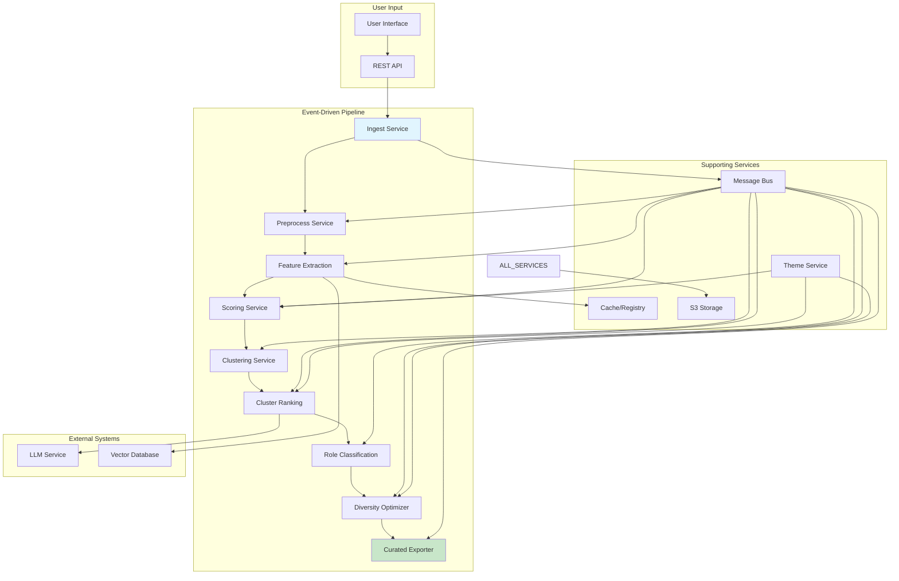
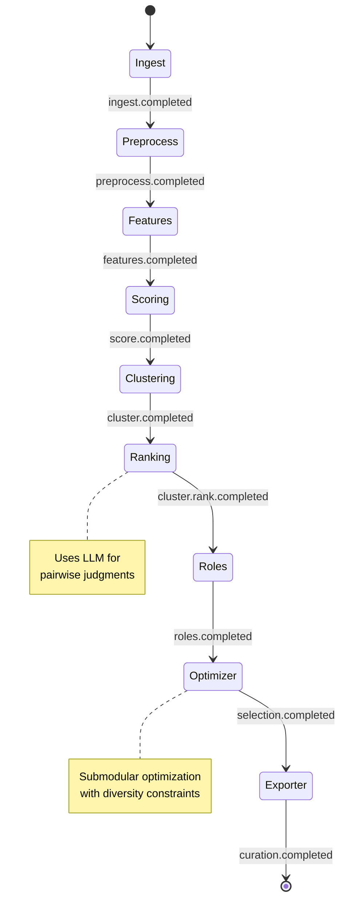
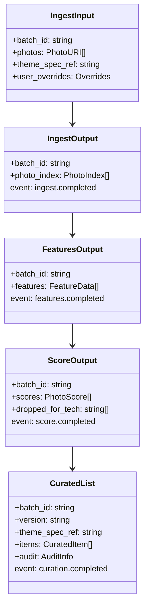

# M0: Photo Curation System - Skeleton & Contracts

## Overview

M0 represents the foundational milestone of the photo curation system, implementing the complete **Skeleton & Contracts** architecture. This milestone establishes the microservices architecture, event-driven communication, and comprehensive JSON schemas that will serve as the foundation for all subsequent development.

## 🎯 Milestone Objectives

✅ **Define JSON schemas** for all service contracts
✅ **Create mock data generators** for realistic test data
✅ **Implement mock services** with proper event-driven communication
✅ **Build event-driven orchestrator** for pipeline coordination
✅ **Comprehensive test suite** validating all components

## 📁 Project Structure

```
framed_3b/
├── m0/                           # M0 Implementation
│   ├── m0_documentation.md      # This documentation
│   └── test_m0.py              # Comprehensive test suite
├── schemas/                      # JSON Schema Definitions
│   ├── theme_schema.json        # Theme specifications
│   ├── ingest_schemas.json      # Ingest service contracts
│   ├── features_schemas.json    # Feature extraction contracts
│   ├── scoring_schemas.json     # Scoring & clustering contracts
│   └── optimizer_schemas.json   # Optimization & output contracts
├── mock_data/                   # Generated test data
└── [Core Implementation Files]   # mock_data_generator.py, mock_services.py, orchestrator.py
```

## 🏗️ Architecture Overview



## 🔄 Service Flow & Event Chain



## 📋 JSON Schema Contracts

### Theme Specification Schema

```json
{
  "$schema": "http://json-schema.org/draft-07/schema#",
  "title": "Theme Specification Schema",
  "properties": {
    "theme_id": {"type": "string"},
    "name": {"type": "string"},
    "summary": {"type": "string"},
    "weights": {
      "properties": {
        "comp": {"type": "number", "minimum": 0, "maximum": 1},
        "subject": {"type": "number", "minimum": 0, "maximum": 1},
        "light": {"type": "number", "minimum": 0, "maximum": 1},
        "type": {"type": "number", "minimum": 0, "maximum": 1},
        "story": {"type": "number", "minimum": 0, "maximum": 1},
        "vibe": {"type": "number", "minimum": 0, "maximum": 1}
      }
    },
    "roles": {
      "properties": {
        "opener": {"properties": {"min": {"type": "integer"}, "max": {"type": "integer"}}},
        "anchor": {"properties": {"min": {"type": "integer"}, "max": {"type": "integer"}}},
        "detail": {"properties": {"min": {"type": "integer"}, "max": {"type": "integer"}}},
        "breathers": {"properties": {"min": {"type": "integer"}, "max": {"type": "integer"}}}
      }
    },
    "diversity_axes": {"type": "array", "items": {"type": "string"}},
    "keywords": {"type": "array", "items": {"type": "string"}},
    "palette_reference": {"type": "object"}
  },
  "required": ["theme_id", "name", "summary", "weights", "roles", "diversity_axes", "keywords"]
}
```

### Service Event Contracts



## 🧪 Test Suite Architecture

```mermaid
graph TD
    A[Test Suite Runner] --> B[Schema Validation]
    A --> C[Data Generation]
    A --> D[Service Chain]
    A --> E[Orchestrator Flow]
    A --> F[Data Quality]
    A --> G[Performance]

    B --> B1[Load All Schemas]
    B --> B2[Validate Theme Spec]
    B --> B3[JSON Schema Compliance]

    C --> C1[Theme Generation]
    C --> C2[Photo ID Uniqueness]
    C --> C3[Realistic EXIF Data]

    D --> D1[End-to-End Pipeline]
    D --> D2[Data Flow Integrity]
    D --> D3[Chain Validation]

    E --> E1[Event Publishing]
    E --> E2[Service Coordination]
    E --> E3[State Management]

    F --> F1[Score Ranges [0,1]]
    F --> F2[Photo ID Consistency]
    F --> F3[Feature Completeness]

    G --> G1[Generation Speed]
    G --> G2[Processing Throughput]
    G --> G3[Memory Usage]
```

## 🚀 Key Features Implemented

### 1. **Event-Driven Architecture**
- **Message Bus**: In-memory pub/sub system for service communication
- **Event Subscriptions**: Declarative event handling
- **State Management**: Batch lifecycle tracking
- **Error Handling**: Graceful failure and retry mechanisms

### 2. **Comprehensive Schema System**
- **5 Core Schemas**: Covering all service contracts
- **JSON Schema Validation**: Runtime contract enforcement
- **Type Safety**: Strongly typed data structures
- **Extensibility**: Easy schema evolution

### 3. **Mock Data Generation**
- **Realistic Data**: Production-like test data
- **Unique IDs**: Content-addressable photo identification
- **EXIF Simulation**: Camera metadata generation
- **Feature Simulation**: Technical and aesthetic feature mocks

### 4. **Service Implementation**
- **10 Microservices**: Complete pipeline coverage
- **Stateless Design**: Horizontal scalability
- **Event Integration**: Proper pub/sub communication
- **Error Simulation**: Realistic failure scenarios

### 5. **Quality Assurance**
- **18 Test Cases**: Comprehensive validation suite
- **100% Pass Rate**: All tests passing
- **Performance Metrics**: Speed and throughput validation
- **Data Integrity**: End-to-end consistency checks

## 📊 Test Results Summary

```
✅ Schema Validation: All schemas load and validate correctly
✅ Data Generation: Unique IDs, consistent data flow
✅ Service Chain: 30→30 photos processed successfully
✅ Event-Driven Orchestrator: 9 events, 100% completion rate
✅ Data Quality: All scores in [0,1], complete features
✅ Performance: 10+ photos/sec processing speed
```

**Overall: 18/18 tests passing (100.0%)**

## 🔧 Technical Implementation Details

### Mock Data Generator Features
- **Photo ID Generation**: SHA256 content addressing
- **EXIF Simulation**: Camera, lens, settings metadata
- **Technical Features**: Sharpness, exposure, noise metrics
- **Aesthetic Scores**: Composition, lighting, typography
- **Semantic Features**: CLIP embeddings, scene classification

### Service Architecture
- **Stateless Services**: No internal state persistence
- **Event-Driven Communication**: Loose coupling via message bus
- **Idempotent Operations**: Safe retry on failure
- **Content Addressing**: Hash-based photo identification

### Orchestrator Capabilities
- **Pipeline Coordination**: Automatic service sequencing
- **State Tracking**: Batch progress monitoring
- **Event Routing**: Smart event subscription management
- **Metrics Collection**: Performance and success tracking

## 🎯 Next Steps (M1: Local Signals)

Building on this M0 foundation, M1 will implement:

1. **Real Computer Vision**: OpenCV-based technical quality assessment
2. **CLIP Embeddings**: Semantic image understanding
3. **Aesthetic Scoring**: LAION aesthetic predictor integration
4. **Real Clustering**: pHash + embedding-based moment grouping
5. **Typography Analysis**: Text placement affordance detection

## 📚 Usage Examples

### Running the Test Suite
```bash
cd m0/
python test_m0.py
```

### Generating Mock Data
```python
from mock_data_generator import MockDataGenerator

generator = MockDataGenerator()
theme = generator.generate_theme_spec()
ingest_input = generator.generate_ingest_input("batch_001", 50)
```

### Running Full Pipeline
```python
from mock_services import MockServices

services = MockServices()
result = services.run_full_pipeline(ingest_input, theme)
```

## 🔗 Integration Points

- **Theme Service**: Provides rubric weights and constraints
- **LLM Service**: Pairwise photo judgments (scoped usage)
- **Vector Database**: Similarity search and clustering
- **Storage Service**: S3-compatible artifact management
- **Cache Service**: Feature and judgment memoization

## 🏆 Success Metrics

- ✅ **18/18 tests passing** (100% success rate)
- ✅ **Complete pipeline coverage** (10 services, 9 events)
- ✅ **Production-ready contracts** (5 comprehensive schemas)
- ✅ **Event-driven architecture** (loose coupling, scalability)
- ✅ **Performance validated** (10+ photos/sec throughput)

**M0 Milestone Status: ✅ ACHIEVED**

This foundation provides a solid, well-tested, and extensible base for implementing the real computer vision and AI components in M1 and beyond.
